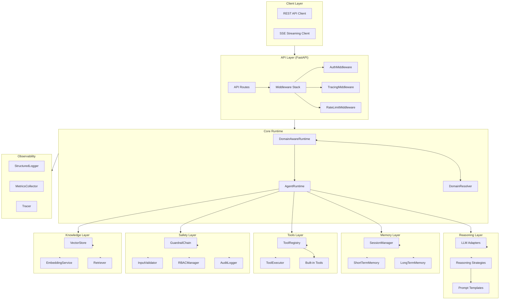
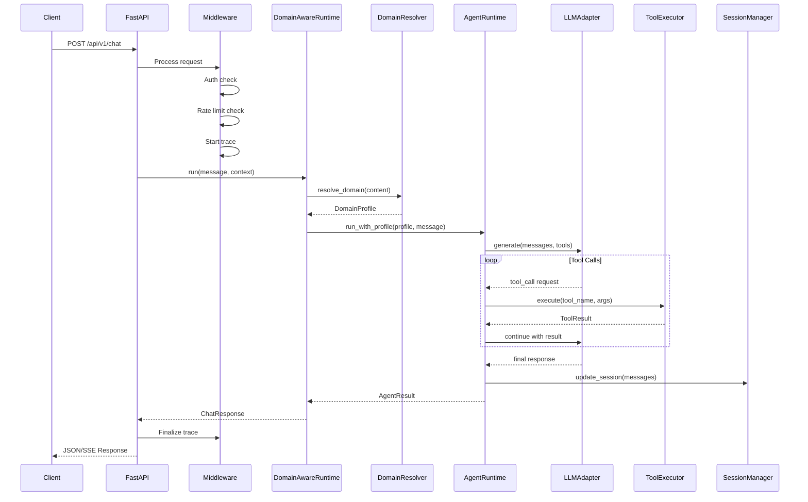
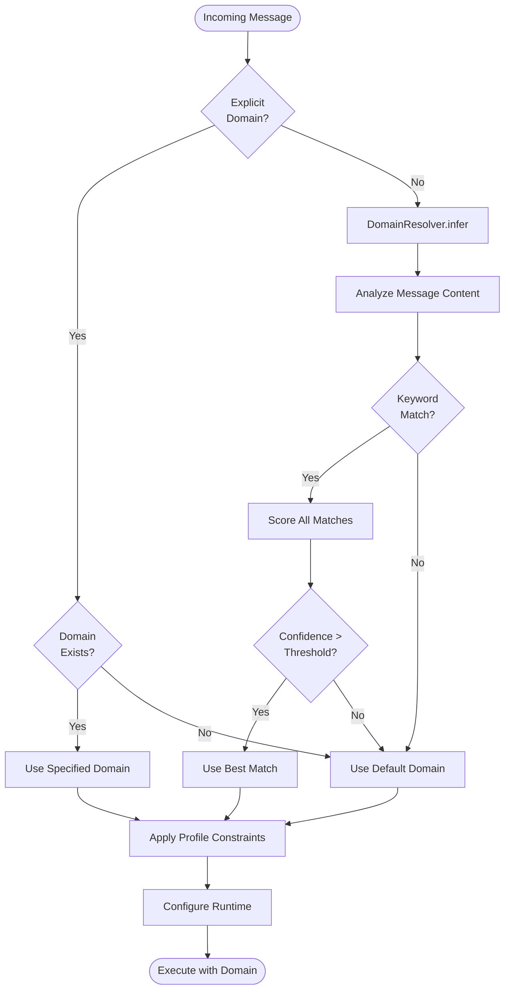
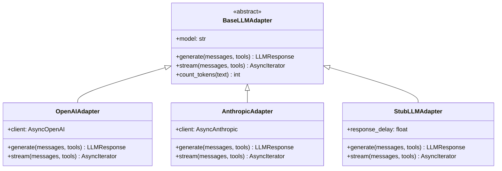
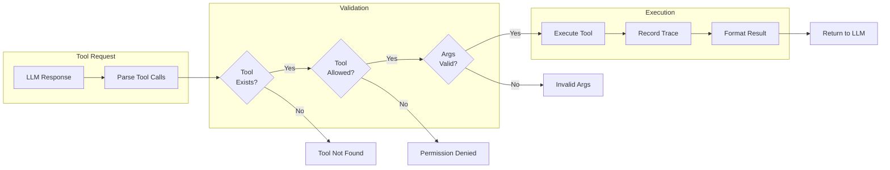
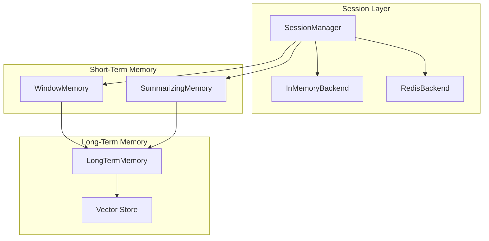
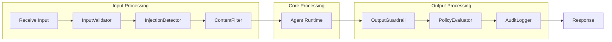

# Aegis Agent Platform Architecture

> **Last Updated:** January 2026
> **Version:** 1.0.0

## Overview

Aegis is a production-ready AI agent platform designed for enterprise deployments. It provides a modular, extensible architecture with domain-aware routing, multi-LLM support, and comprehensive observability.

## System Architecture



## Module Structure

```
src/
├── api/                    # FastAPI REST API
│   ├── app.py              # Application factory & lifespan
│   ├── dependencies.py     # Dependency injection
│   ├── middleware.py       # Rate limiting, auth, tracing
│   ├── streaming.py        # SSE streaming support
│   └── routes/             # API endpoints
│       ├── chat.py         # Chat completions
│       ├── sessions.py     # Session management
│       ├── tools.py        # Tool introspection
│       ├── domains.py      # Domain profiles
│       ├── health.py       # Health checks
│       └── admin.py        # Administrative endpoints
│
├── config/                 # Configuration management
│   ├── settings.py         # Application settings
│   ├── model_routing.py    # LLM model routing
│   └── secrets.py          # Secrets management
│
├── core/                   # Core types & interfaces
│   ├── types.py            # Pydantic models & types
│   ├── interfaces.py       # Protocol definitions
│   └── exceptions.py       # Custom exceptions
│
├── domains/                # Domain profile system
│   ├── profile.py          # DomainProfile model
│   ├── registry.py         # DomainRegistry
│   ├── resolver.py         # Domain resolution logic
│   └── runtime.py          # DomainAwareRuntime
│
├── knowledge/              # RAG & knowledge base
│   ├── vector_store.py     # FAISS/Milvus adapters
│   ├── embeddings.py       # Embedding services
│   ├── retriever.py        # Context retrieval
│   ├── chunking.py         # Text chunking strategies
│   └── ingestion.py        # Document ingestion
│
├── memory/                 # State & memory management
│   ├── session.py          # Session management
│   ├── short_term.py       # Conversation window
│   ├── long_term.py        # Persistent memory
│   └── retrieval.py        # Memory retrieval
│
├── observability/          # Monitoring & logging
│   ├── logging.py          # Structured logging
│   ├── metrics.py          # Prometheus metrics
│   ├── tracing.py          # Distributed tracing
│   └── evaluation.py       # Evaluation harness
│
├── planning/               # Task planning
│   ├── controller.py       # Execution controller
│   ├── decomposer.py       # Task decomposition
│   └── checkpoints.py      # Checkpoint management
│
├── reasoning/              # LLM & reasoning
│   ├── llm/                # LLM adapters
│   │   ├── base.py         # Base adapter interface
│   │   ├── openai_adapter.py
│   │   ├── anthropic_adapter.py
│   │   └── stub_adapter.py # Offline mode stub
│   ├── prompts/            # Prompt management
│   │   └── template.py     # Jinja2 templates
│   └── strategies/         # Reasoning strategies
│       ├── base.py         # Strategy interface
│       ├── react.py        # ReAct pattern
│       └── tool_calling.py # Native tool calling
│
├── runtime/                # Agent runtime
│   ├── agent.py            # AgentRuntime core
│   └── factory.py          # Runtime factory
│
├── safety/                 # Security & compliance
│   ├── guardrails.py       # Input/output guardrails
│   ├── input_validation.py # Injection detection
│   ├── rbac.py             # Role-based access
│   └── audit.py            # Audit logging
│
├── tools/                  # Tool system
│   ├── registry.py         # Tool registration
│   ├── executor.py         # Tool execution
│   ├── permissions.py      # Tool permissions
│   ├── builtin.py          # Built-in tools
│   └── tracing.py          # Tool tracing
│
└── advanced/               # Advanced features
    ├── multi_agent.py      # Multi-agent orchestration
    ├── plugins.py          # Plugin system
    └── critic.py           # Self-critique loop
```

## Request Flow



## Domain Resolution Flow



## LLM Adapter System



## Tool Execution Flow



## Memory Architecture



## Safety & Guardrails



## Configuration

### Environment Variables

| Variable | Description | Default |
|----------|-------------|---------|
| `LLM_OFFLINE_MODE` | Use stub adapter | `false` |
| `REDIS_ENABLED` | Enable Redis backend | `true` |
| `REDIS_URL` | Redis connection URL | `redis://localhost:6379` |
| `OPENAI_API_KEY` | OpenAI API key | - |
| `ANTHROPIC_API_KEY` | Anthropic API key | - |
| `LOG_LEVEL` | Logging level | `INFO` |
| `RATE_LIMIT_REQUESTS` | Requests per window | `100` |
| `RATE_LIMIT_WINDOW` | Window in seconds | `60` |

### Domain Profile Configuration

Domain profiles are defined in YAML files under `config/domains/`:

```yaml
name: financial_analysis
version: "1.0.0"
display_name: "Financial Analysis Assistant"
description: |
  Financial analyst assistant for portfolio analysis,
  market research, and investment insights.

tags:
  - finance
  - investment
  - analysis

system_prompt: |
  You are a financial analyst assistant...

inference:
  keywords:
    - stock
    - investment
    - portfolio
  priority: 80
  confidence_threshold: 0.7

tools:
  allowed:
    - calculate
    - json_parse
  denied:
    - http_get

guardrails:
  max_output_tokens: 4000
  block_code_execution: true
```

## Deployment

### Docker Profiles

| Profile | Description | Services |
|---------|-------------|----------|
| default | Standard deployment | aegis, redis |
| dev | Development with hot reload | aegis-dev, redis |
| offline | No external dependencies | aegis-offline |

### Running Offline Mode

```bash
# Build and run without external LLM dependencies
docker compose --profile offline up -d aegis-offline

# Verify health
curl http://localhost:8002/health

# Test chat (uses StubLLMAdapter)
curl -X POST http://localhost:8002/api/v1/chat \
  -H "Content-Type: application/json" \
  -d '{"message": "Hello!"}'
```

## API Endpoints

| Endpoint | Method | Description |
|----------|--------|-------------|
| `/health` | GET | Health check |
| `/docs` | GET | Swagger UI |
| `/api/v1/chat` | POST | Send chat message |
| `/api/v1/sessions` | POST | Create session |
| `/api/v1/sessions` | GET | List sessions |
| `/api/v1/sessions/{id}` | GET | Get session |
| `/api/v1/sessions/{id}` | DELETE | Delete session |
| `/api/v1/tools` | GET | List available tools |
| `/api/v1/domains` | GET | List domain profiles |
| `/api/v1/domains/{name}` | GET | Get domain details |

## References

- [Domain System Documentation](DOMAIN_SYSTEM.md)
- [System Integration Guide](SYSTEM_INTEGRATION.md)
- [Consolidation Report](CONSOLIDATION.md)
